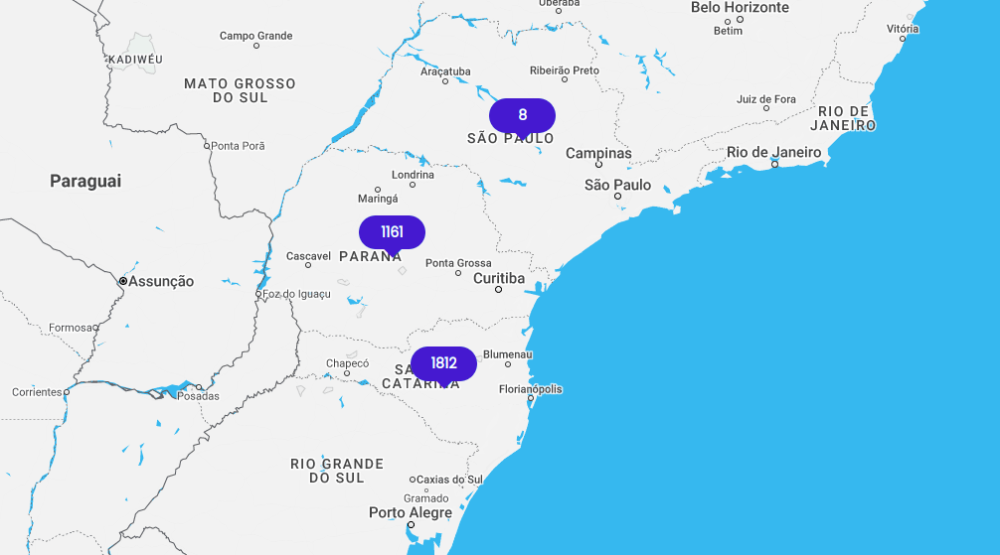

# googlemap-custom-marker-vue

This component makes it simple to display some custom Vue reactive components on a google map.



## ⚠️ important note

This project is a plugin for [@fawmi/vue-google-maps](https://github.com/fawmi/vue-google-maps). It was adapted from the repository [eregnier/vue2-gmap-custom-marker](https://github.com/eregnier/vue2-gmap-custom-marker).

## Installation

Install the package from [npm](https://www.npmjs.com/package/googlemap-custom-marker-vue):

`npm i googlemap-custom-marker-vue`

## Basic Usage

Import the component and use it in the components object.

```javascript
import GmapCustomMarker from 'googlemap-custom-marker-vue';
```

Use the custom marker inside the map component. Add HTML or other Vue components inside the custom marker to be rendered on the map.

```vue
<GmapMap>
  <GmapCustomMarker :marker="marker">
    
    <my-component></my-component>
  </GmapCustomMarker>
</GmapMap>

<script>
export default = {
  [...],
  data() {
    return {
      marker: {
        lat: 50.60229509638775,
        lng: 3.0247059387528408
      }
    }
  [...]
}
</script>
```

Use the `@click` event with the `.native` modifier to bind a function to the clicking of the custom marker.

```vue
<GmapMap>
  <GmapCustomMarker
    :marker="{ lat: 50.60229509638775, lng: 3.0247059387528408 }"
    @click.native="someFunction"
  >
    
    <my-component></my-component>
  </GmapCustomMarker>
</GmapMap>
```

Specify the alignment of the marker with the `alignment` prop. Accepts 13 values: `top`, `bottom`, `left`, `right`, `center`, `topleft` | `lefttop`, `topright` | `righttop`, `bottomleft` | `leftbottom`, `bottomright` | `rightbottom`. Defines the alignment of the marker relative to the lat/lng specified, e.g. `bottomright` - the marker will be below and on the right of the location.

 ```vue
 <GmapCustomMarker
  :marker="marker"
  alignment="bottomright"
>
</GmapCustomMarker>
 ```

Manually specify an offset value for the marker in pixels with prop `offsetX` | `offsetY`. A positive `offsetX` moves the marker further right, and a positive `offsetY` moves the marker further down the page. Can be used with the `alignment` prop.

 ```vue
 <GmapCustomMarker
  :marker="marker"
  :offsetX="-10"
  :offsetY="17.5"
>
</GmapCustomMarker>
```

## Reference

**Prop**|**Type**|**Default**|**Description**|**Supported Values**
:-----:|:-----:|:-----:|:-----:|:-----:
`marker`|Object|`null`|Provide the latitude and longitude values that the marker should be displayed at. **Required**|Provide an Object with `lat` and `lng` properties. `{ lat: Number, lng: Number }`
`offsetX`|Number|`0`|The number of pixels to move the marker by in the x-direction. Postive values move the marker to the right|Positive or negative number.
`offsetY`|Number|`0`|The number of pixels to move the marker by in the y-direction. Postive values move the marker to down the page.|Positive or negative number.
`alignment`|String|`top`|The alignment of the marker element relative to the location it is displayed. e.g. `bottomright` - the marker will be below and on the right of the location.|`top`, `bottom`, `left`, `right`, `center`, `topleft`  `lefttop`, `topright`, `righttop`, `bottomleft`, `leftbottom`, `bottomright`, `rightbottom`
`zIndex`|Number|`50`| z-index of the marker. | Positive number.
`nuxtMode`|Boolean|true| Avoid marker displacement on navigation in Nuxt. | `true`, `false`